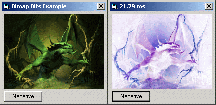



## Using GetBitmapBits and SetBitmapBits

### Description

This example program shows you how to use GetBitmapBits and SetBitmapBits for super fast pixel manipulation. Please note that I chose to turn a picture negative to show you the basics of these 2 APIs and that there are faster ways to turn a picture negative. Such as using BitBlt, but BitBlt is not capable of manipulating individual pixels, it just transfers a block of picture bits with various options. Please see XasanSoft's submission using BitBlt to turn a picture negative. This could also be used for changing a pictures brightness level or Red, Green and Blue tints. The posibilites are endless! With this example, you should never have to use GetPixel and SetPixel again for pixel manipulation. This is only slightly more complicated than them and 10 times faster. Enjoy the code!
 
### More Info
 

             |
---                |---
**Submitted On**   |2002-08-06 15:14:24
**By**             |[¿?¿?](https://github.com/Planet-Source-Code/PSCIndex/blob/master/ByAuthor/empty.md)
**Level**          |Intermediate
**User Rating**    |4.0 (32 globes from 8 users)
**Compatibility**  |VB 6\.0
**Category**       |[Graphics](https://github.com/Planet-Source-Code/PSCIndex/blob/master/ByCategory/graphics__1-46.md)
**World**          |[Visual Basic](https://github.com/Planet-Source-Code/PSCIndex/blob/master/ByWorld/visual-basic.md)
**Archive File**   |[Using\_GetB115175862002\.zip](https://github.com/Planet-Source-Code/using-getbitmapbits-and-setbitmapbits__1-37691/archive/master.zip)

### API Declarations

GetBitmapBits, SetBitmapBits and a few others.

